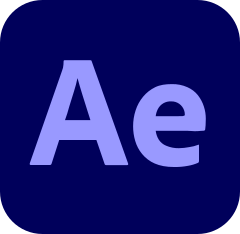

# Gland Jermano Blessed Siahaan

### AI Assisted Project Builder | Web and Mobile Development Learner

  
  
  
  

---

## About Me

Hi, I am **Gland Jermano Blessed Siahaan**.

I am currently learning software development by building real projects through an AI assisted workflow. My focus is not only writing code, but also understanding how a project is planned, structured, documented, tested, improved, and managed with GitHub.

I use vibe coding as a practical learning method. It helps me move from ideas into working prototypes while I continue improving my programming fundamentals, problem solving skills, user interface sense, and project documentation.

---

## Animated Profile

 

Click the animation to watch the full video on TikTok

---

## Current Focus

I am currently focused on building real projects, learning project structure, improving documentation, and using AI tools as a support system for planning, coding, debugging, and iteration.

<table>
  <tr>
    <td><strong>Project Based Learning</strong></td>
    <td>Building web and mobile projects as learning documentation.</td>
  </tr>
  <tr>
    <td><strong>AI Assisted Development</strong></td>
    <td>Using AI tools to support planning, coding, debugging, documentation, and improvement.</td>
  </tr>
  <tr>
    <td><strong>Frontend Structure</strong></td>
    <td>Learning layout, styling, page structure, reusable components, and responsive design.</td>
  </tr>
  <tr>
    <td><strong>Mobile Application</strong></td>
    <td>Exploring Flutter, Dart, local data, Firebase, and mobile user experience.</td>
  </tr>
  <tr>
    <td><strong>Project Management</strong></td>
    <td>Organizing folders, README files, assets, versioning, and Git workflow.</td>
  </tr>
</table>

---

## Tech and Creative Stack

### Coding, Development, OS, and AI Tools

  

  

  

### Creative and Design Tools

<table>
  <tr>
    <td align="center" width="110">
      
       
      <strong>Canva</strong>
    </td>
    <td align="center" width="110">
      
       
      <strong>PowerPoint</strong>
    </td>
    <td align="center" width="110">
      
       
      <strong>Photoshop</strong>
    </td>
    <td align="center" width="110">
      
       
      <strong>Illustrator</strong>
    </td>
    <td align="center" width="110">
      
       
      <strong>After Effects</strong>
    </td>
  </tr>
</table>

---

## Skill Composition

This composition is based on my personal self assessment. It is not an expert claim. It shows where my current learning strength and creative workflow are focused.

<table>
  <tr>
    <th>Skill or Tool</th>
    <th>Composition</th>
    <th>Visual</th>
  </tr>
  <tr>
    <td><strong>AI Assisted Development Workflow</strong></td>
    <td>31.47%</td>
    <td>███████████████████████████████</td>
  </tr>
  <tr>
    <td><strong>Canva</strong></td>
    <td>31.47%</td>
    <td>███████████████████████████████</td>
  </tr>
  <tr>
    <td><strong>PowerPoint Design</strong></td>
    <td>20.98%</td>
    <td>█████████████████████</td>
  </tr>
  <tr>
    <td><strong>HTML</strong></td>
    <td>5.24%</td>
    <td>█████</td>
  </tr>
  <tr>
    <td><strong>Photoshop</strong></td>
    <td>3.50%</td>
    <td>████</td>
  </tr>
  <tr>
    <td><strong>Python</strong></td>
    <td>1.75%</td>
    <td>██</td>
  </tr>
  <tr>
    <td><strong>Illustrator</strong></td>
    <td>1.75%</td>
    <td>██</td>
  </tr>
  <tr>
    <td><strong>After Effects</strong></td>
    <td>1.74%</td>
    <td>██</td>
  </tr>
  <tr>
    <td><strong>CSS</strong></td>
    <td>0.70%</td>
    <td>█</td>
  </tr>
  <tr>
    <td><strong>JavaScript</strong></td>
    <td>0.70%</td>
    <td>█</td>
  </tr>
  <tr>
    <td><strong>Tailwind CSS</strong></td>
    <td>0.70%</td>
    <td>█</td>
  </tr>
</table>

---

## Featured Projects

<table>
  <tr>
    <th>Project</th>
    <th>Focus</th>
    <th>Stack and Direction</th>
  </tr>
  <tr>
    <td>
      <a href="https://github.com/GblessSHN-boop/gland-portfolio">
        <strong>Personal Portfolio Website</strong>
      </a>
    </td>
    <td>Personal portfolio website project.</td>
    <td>HTML, CSS, JavaScript, Python, MySQL.</td>
  </tr>
  <tr>
    <td>
      <a href="https://github.com/GblessSHN-boop/project-web-fft-uasn-vibe-coding">
        <strong>Web FFT UASN</strong>
      </a>
    </td>
    <td>Faculty website for Philosophy and Theology.</td>
    <td>Flask, PostgreSQL, frontend structure, backend structure, documentation.</td>
  </tr>
  <tr>
    <td>
      <a href="https://github.com/GblessSHN-boop/final-semester-2-mobile-app-vibe-coding">
        <strong>Semester 2 Mobile App</strong>
      </a>
    </td>
    <td>Mobile application for IPS and IPK academic calculation.</td>
    <td>Flutter, Dart, Firebase Authentication, Cloud Firestore.</td>
  </tr>
  <tr>
    <td>
      <a href="https://github.com/GblessSHN-boop/arcdev-university-website-vibe-coding">
        <strong>ARCDEV University Website</strong>
      </a>
    </td>
    <td>Frontend only university website prototype.</td>
    <td>Astro, Tailwind CSS, bilingual content, campus profile, admissions, newsroom.</td>
  </tr>
  <tr>
    <td>
      <a href="https://github.com/GblessSHN-boop/arcflow-mobile-app-vibe-coding-v1">
        <strong>ARCFlow Mobile App</strong>
      </a>
    </td>
    <td>Offline first productivity app for habits, tasks, and daily progress.</td>
    <td>Flutter, Dart, offline first concept, productivity dashboard, habit tracking.</td>
  </tr>
</table>

---

## My Development Workflow

<table>
  <tr>
    <td><strong>1. Idea</strong></td>
    <td>Define the project purpose, target users, main features, and expected output.</td>
  </tr>
  <tr>
    <td><strong>2. Structure</strong></td>
    <td>Create folders, page plans, feature lists, asset locations, and documentation flow.</td>
  </tr>
  <tr>
    <td><strong>3. Build</strong></td>
    <td>Use AI assisted coding while checking the result through manual testing and review.</td>
  </tr>
  <tr>
    <td><strong>4. Improve</strong></td>
    <td>Fix errors, refine user interface, improve file organization, and update documentation.</td>
  </tr>
  <tr>
    <td><strong>5. Document</strong></td>
    <td>Write README files, explain the stack, describe features, and track project progress.</td>
  </tr>
</table>

---

## Learning Direction

I am still building my foundation in programming. My current goal is to become more confident in reading code, understanding project structure, managing repositories, improving documentation, and turning ideas into organized digital products.

My learning principle is simple:

> Build real projects, document the process, improve the structure, and learn from every iteration.

---

## Connect With Me

  
  
  

